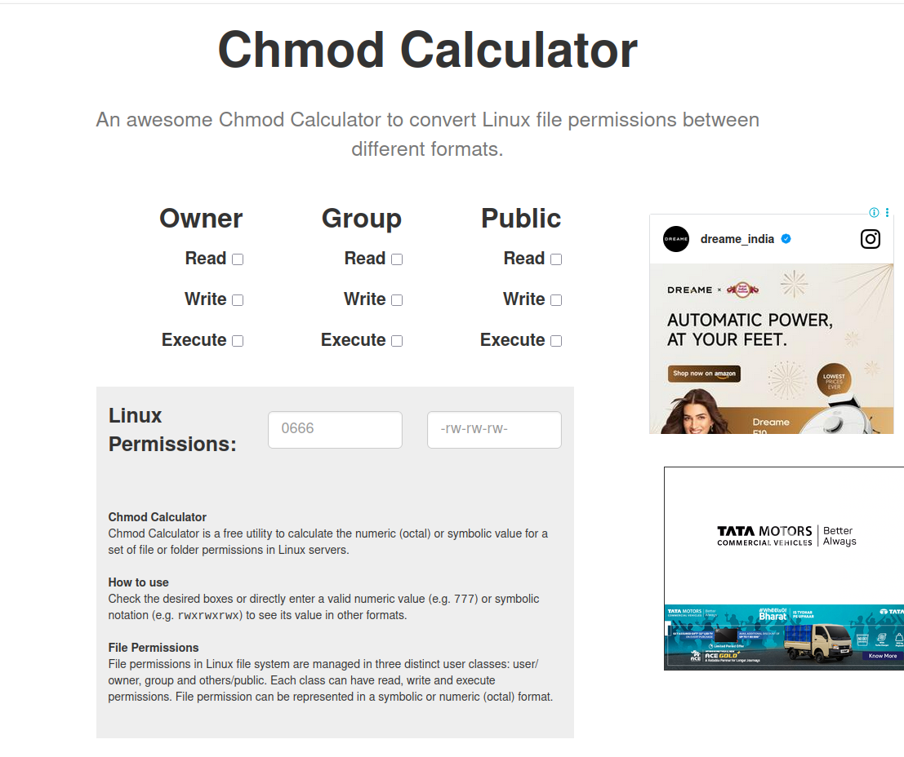

https://chmod-calculator.com/
Chmod Calculator

An awesome Chmod Calculator to convert Linux file permissions between different formats.
Owner
Read
Write
Execute
Group
Read
Write
Execute
Public
Read
Write
Execute
Linux Permissions:

Chmod Calculator
    Chmod Calculator is a free utility to calculate the numeric (octal) or symbolic value for a set of file or folder permissions in Linux servers.
How to use
    Check the desired boxes or directly enter a valid numeric value (e.g. 777) or symbolic notation (e.g. rwxrwxrwx) to see its value in other formats.
File Permissions
    File permissions in Linux file system are managed in three distinct user classes: user/owner, group and others/public. Each class can have read, write and execute permissions. File permission can be represented in a symbolic or numeric (octal) format.

