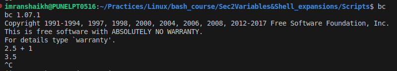
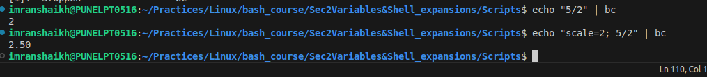
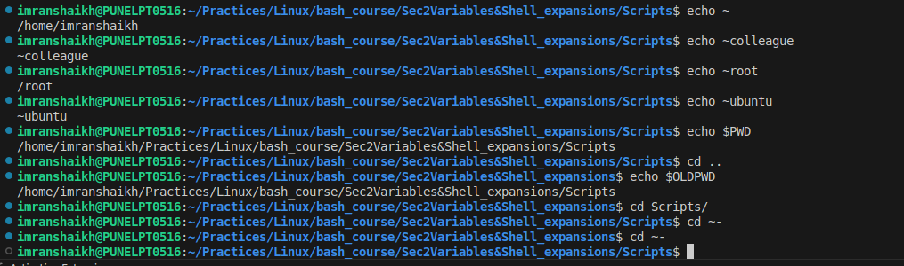
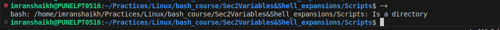
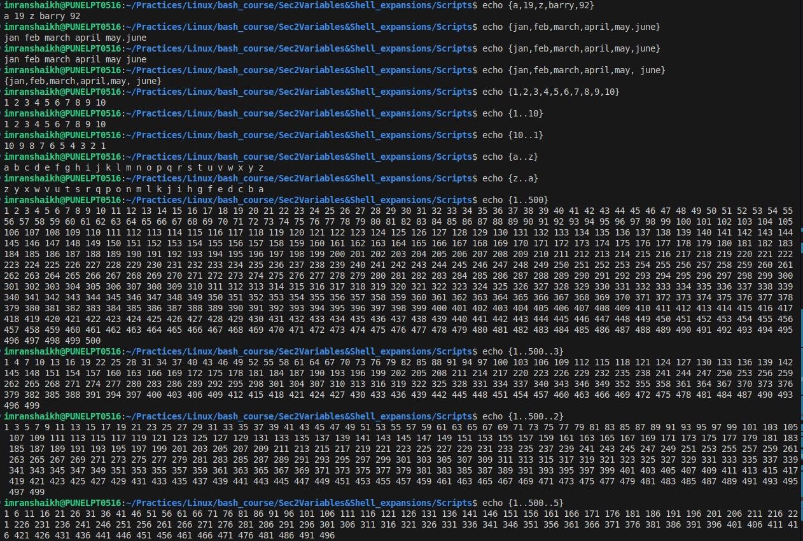
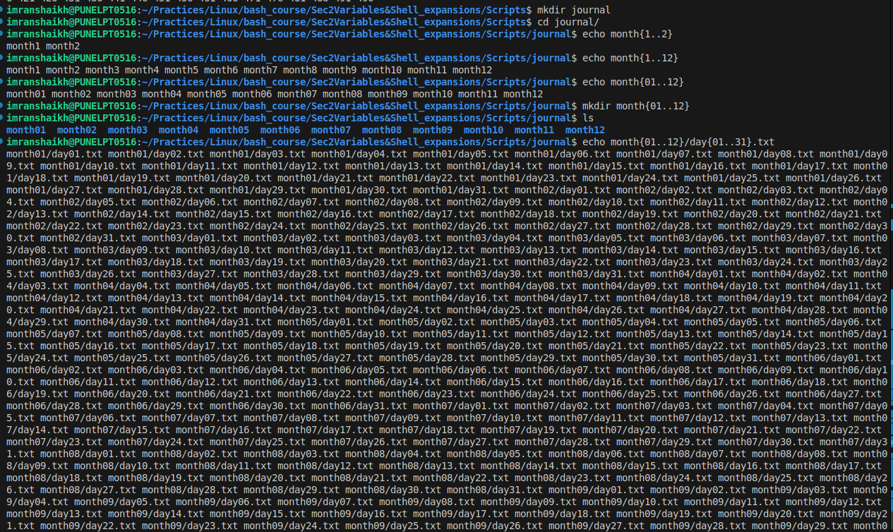
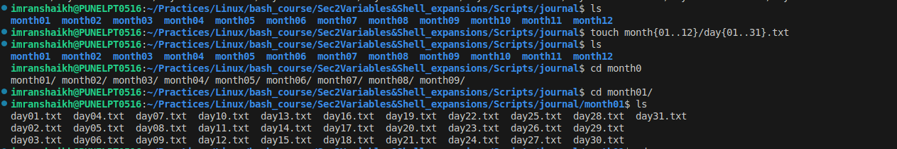

CEO
imranshaikh@PUNELPT0516:~/Practices/Linux/bash_course/Sec2Variables&Shell_expansions/Scripts$ echo $HOSTTYPE
x86_64
imranshaikh@PUNELPT0516:~/Practices/Linux/bash_course/Sec2Variables&Shell_expansions/Scripts$ lsb_release -a
No LSB modules are available.
Distributor ID: Ubuntu
Description:    Ubuntu 22.04.5 LTS
Release:        22.04
Codename:       jammy
imranshaikh@PUNELPT0516:~/Practices/Linux/bash_course/Sec2Variables&Shell_expansions/Scripts$ uname -a
Linux PUNELPT0516 6.8.0-85-generic #85~22.04.1-Ubuntu SMP PREEMPT_DYNAMIC Fri Sep 19 16:18:59 UTC 2 x86_64 x86_64 x86_64 GNU/Linux
imranshaikh@PUNELPT0516:~/Practices/Linux/bash_course/Sec2Variables&Shell_expansions/Scripts$ hostname
PUNELPT0516

imranshaikh@PUNELPT0516:~/Practices/Linux/bash_course/Sec2Variables&Shell_expansions/Scripts$ echo $USER
imranshaikh
imranshaikh@PUNELPT0516:~/Practices/Linux/bash_course/Sec2Variables&Shell_expansions/Scripts$ echo $HOSTTYPE
x86_64

imranshaikh@PUNELPT0516:~/Practices/Linux/bash_course/Sec2Variables&Shell_expansions/Scripts$ name=Imran
imranshaikh@PUNELPT0516:~/Practices/Linux/bash_course/Sec2Variables&Shell_expansions/Scripts$ echo $name
Imran
imranshaikh@PUNELPT0516:~/Practices/Linux/bash_course/Sec2Variables&Shell_expansions/Scripts$ echo ${name,}
imran

imranshaikh@PUNELPT0516:~/Practices/Linux/bash_course/Sec2Variables&Shell_expansions/Scripts$ echo ${name,}
imran
imranshaikh@PUNELPT0516:~/Practices/Linux/bash_course/Sec2Variables&Shell_expansions/Scripts$ name=ImRaN
imranshaikh@PUNELPT0516:~/Practices/Linux/bash_course/Sec2Variables&Shell_expansions/Scripts$ echo ${name}
ImRaN
imranshaikh@PUNELPT0516:~/Practices/Linux/bash_course/Sec2Variables&Shell_expansions/Scripts$ echo ${name,}
imRaN
imranshaikh@PUNELPT0516:~/Practices/Linux/bash_course/Sec2Variables&Shell_expansions/Scripts$ echo ${name,,}
imran
imranshaikh@PUNELPT0516:~/Practices/Linux/bash_course/Sec2Variables&Shell_expansions/Scripts$ echo $user

imranshaikh@PUNELPT0516:~/Practices/Linux/bash_course/Sec2Variables&Shell_expansions/Scripts$ echo $USER
imranshaikh
imranshaikh@PUNELPT0516:~/Practices/Linux/bash_course/Sec2Variables&Shell_expansions/Scripts$ echo ${USER^}
Imranshaikh
imranshaikh@PUNELPT0516:~/Practices/Linux/bash_course/Sec2Variables&Shell_expansions/Scripts$ echo ${USER^^}
IMRANSHAIKH
imranshaikh@PUNELPT0516:~/Practices/Linux/bash_course/Sec2Variables&Shell_expansions/Scripts$ echo ${#name}
5
imranshaikh@PUNELPT0516:~/Practices/Linux/bash_course/Sec2Variables&Shell_expansions/Scripts$ echo ${name}
ImRaN
imranshaikh@PUNELPT0516:~/Practices/Linux/bash_course/Sec2Variables&Shell_expansions/Scripts$ echo ${name^^}
IMRAN
imranshaikh@PUNELPT0516:~/Practices/Linux/bash_course/Sec2Variables&Shell_expansions/Scripts$ echo ${#USER}
11
imranshaikh@PUNELPT0516:~/Practices/Linux/bash_course/Sec2Variables&Shell_expansions/Scripts$ $ numbers=0123456789
$: command not found
imranshaikh@PUNELPT0516:~/Practices/Linux/bash_course/Sec2Variables&Shell_expansions/Scripts$ numbers=0123456789
imranshaikh@PUNELPT0516:~/Practices/Linux/bash_course/Sec2Variables&Shell_expansions/Scripts$ ${parameter:offset:length}
imranshaikh@PUNELPT0516:~/Practices/Linux/bash_course/Sec2Variables&Shell_expansions/Scripts$ echo ${numbers:0:7}
0123456

imranshaikh@PUNELPT0516:~/Practices/Linux/bash_course/Sec2Variables&Shell_expansions/Scripts$ echo ${numbers:1:5}
12345
imranshaikh@PUNELPT0516:~/Practices/Linux/bash_course/Sec2Variables&Shell_expansions/Scripts$ echo ${numbers:0:7}
0123456
imranshaikh@PUNELPT0516:~/Practices/Linux/bash_course/Sec2Variables&Shell_expansions/Scripts$ echo ${numbers:1:5}
12345
imranshaikh@PUNELPT0516:~/Practices/Linux/bash_course/Sec2Variables&Shell_expansions/Scripts$ echo ${numbers: -3:2}
78  
imranshaikh@PUNELPT0516:~/Practices/Linux/bash_course/Sec2Variables&Shell_expansions/Scripts$ echo ${numbers: -3}
789

Command Substitution:
Example of it

Parameter Expansion
${parameter}

Command Expansion
$(command)

Arithematic Expansion:
$((expression))
echo $(( 4+2 ))

#1  echo $(( 5 + 2 ))
#2  echo $(( $x + $y ))
  echo $(( x + y ))
  echo $(( x - y ))
  echo $(( x / y ))
  echo $(( x * y ))

  echo $(( 2 + 3 * 4 ))
  echo $(( (2 + 3) * 4 )

  echo $(( 4 ** 2))

  echo $(( 4 % 2)) ans = 0
  echo $(( 5 % 3)) ans = 2

  for decimeal number
  echo (( 2.5 + 1)) 
  

  echo (( 5 / 3 ))
  

Dealing with Decimal Numbers - The BC command (Basic Calculator)
bc (command)

echo "5/2" | bc

Tilde Expansion

Brace Expansion:
{}

